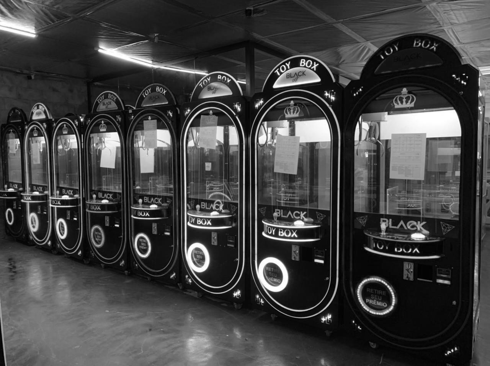
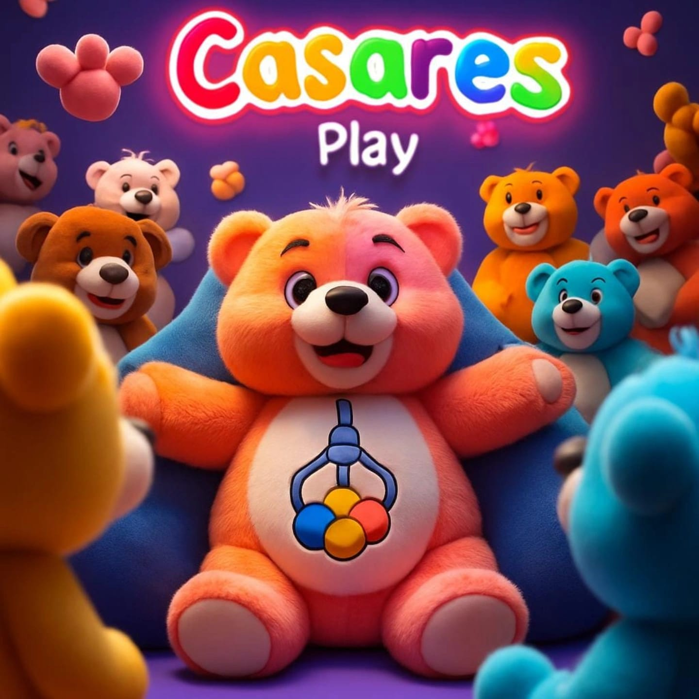
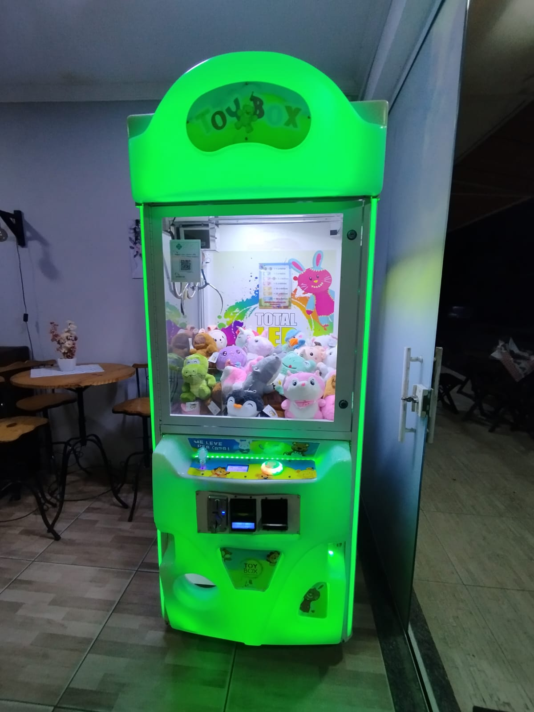
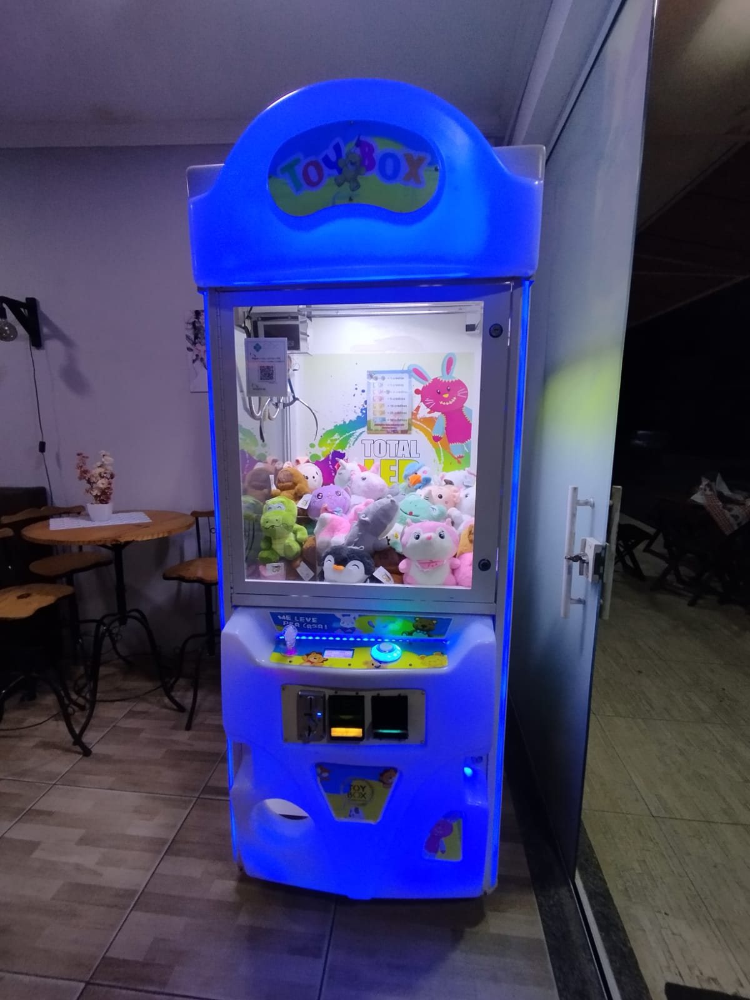
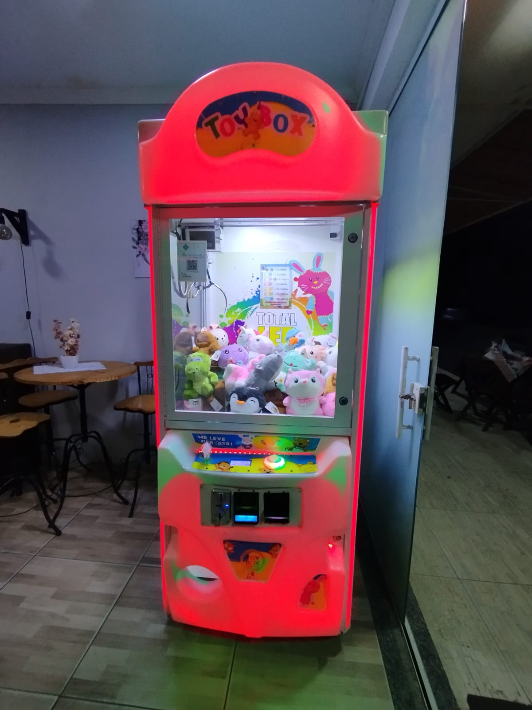

<!doctype html>
<html lang="pt-BR">
<head>
  <meta charset="utf-8">
  <meta name="viewport" content="width=device-width,initial-scale=1">
  <title>CasaRes Play - Aluguel de Máquina de Pelúcia</title>
  
</head>
<body>

<header id="header">
  

    
    <h1>CasaRes Play</h1>
  

  
Aluguel de máquinas de pelúcia — diversão garantida nas festas!

</header>

<main>
  <h2 class="fundo-branco">Pacotes com máquina (4 horas)</h2>
  

  <h2 class="fundo-branco" style="margin-top:40px;">Fotos da Máquina</h2>
  

    
    
    
  

  

    <h3>Informações importantes</h3>
    
Tempo de locação: 4 horas. Caso precise de horário estendido ou transporte fora das regiões atendidas, entre em contato.

    <h3>Onde entregamos</h3>
    
Paracambi, Seropédica, Japeri e Conrado — frete grátis nessas localidades.

    <h3>Como reservar</h3>
    <ol>
      <li>Entre em contato por WhatsApp: <a href="https://wa.me/5521968884003" target="_blank">(21) 96888-4003</a>.</li>
      <li>Combine data, horário e endereço de entrega.</li>
      <li>Pagamento: na hora de receber a máquina.</li>
    </ol>
  

</main>

  
  

<footer>
  
© CasaRes Play — Aluguel de máquinas de pelúcia. Contato: (21) 96888-4003 — casaresplayfesta@gmail.com

</footer>

<script>
const precoMaquina = 550;
const precoPorPelucia = 15;

const pacotes = [
  { nome:"Somente máquina", preco:550, itens:["Uso da máquina por 4 horas","Sem pelúcias inclusas","Frete grátis (Paracambi, Seropédica, Japeri, Conrado)"], whatsappMsg:"Olá, quero reservar apenas a máquina" },
  { nome:"30 pelúcias + máquina", preco:1000, itens:["30 pelúcias inclusas","Uso da máquina por 4 horas","Frete grátis"], whatsappMsg:"Olá, quero reservar o pacote de 30 pelúcias com máquina" },
  { nome:"50 pelúcias + máquina", preco:1300, itens:["50 pelúcias inclusas","Uso da máquina por 4 horas","Frete grátis"], whatsappMsg:"Olá, quero reservar o pacote de 50 pelúcias com máquina" },
  { nome:"80 pelúcias + máquina", preco:1750, itens:["80 pelúcias inclusas","Uso da máquina por 4 horas","Frete grátis"], whatsappMsg:"Olá, quero reservar o pacote de 80 pelúcias com máquina" },
  { nome:"Pacote Personalizado", preco:precoMaquina, itens:["Uso da máquina por 4 horas","Sem pelúcias inclusas","Frete grátis (Paracambi, Seropédica, Japeri, Conrado)"], personalizado:true }
];

const container = document.getElementById("pricing-container");

pacotes.forEach(p=>{
  const pkgDiv = document.createElement("div");
  pkgDiv.classList.add("pkg");

  if(p.personalizado){
    pkgDiv.innerHTML = `
      <h3>${p.nome}</h3>
      
R$ ${p.preco}

      <ul>${p.itens.map(i=>`<li>${i}</li>`).join('')}</ul>
      

        

          <button id="menos">-</button>
          <input type="number" id="inputQtd" min="20" value="20">
          <button id="mais">+</button>
          <button id="addPelucias" style="padding:4px 8px; background:var(--accent); color:#fff; border:none; border-radius:6px;">+ Adicionar pelúcias</button>
        

      

      <a class="cta" id="btnPersonalizado">Reservar pelo WhatsApp</a>
    `;
    container.appendChild(pkgDiv);

    const gavetaContainer = pkgDiv.querySelector(".gaveta-container");
    pkgDiv.addEventListener("click", ()=>{ gavetaContainer.classList.toggle("open"); });

    const inputQtd = pkgDiv.querySelector("#inputQtd");
    const precoPersonalizado = pkgDiv.querySelector("#precoPersonalizado");
    const btnPersonalizado = pkgDiv.querySelector("#btnPersonalizado");
    const btnMais = pkgDiv.querySelector("#mais");
    const btnMenos = pkgDiv.querySelector("#menos");

    function atualizarPreco(){ 
      let qtd = parseInt(inputQtd.value);
      if(isNaN(qtd) || qtd<20) qtd=20; inputQtd.value=qtd;
      const total = precoMaquina + qtd*precoPorPelucia;
      precoPersonalizado.textContent = `R$ ${total}`;
    }

    inputQtd.addEventListener("input", atualizarPreco);
    btnMais.addEventListener("click", e=>{e.stopPropagation(); inputQtd.value=parseInt(inputQtd.value)+1; atualizarPreco();});
    btnMenos.addEventListener("click", e=>{e.stopPropagation(); inputQtd.value=parseInt(inputQtd.value)-1; atualizarPreco();});
    btnPersonalizado.addEventListener("click", e=>{
      e.stopPropagation();
      let qtd = parseInt(inputQtd.value); if(isNaN(qtd)||qtd<20) qtd=20;
      const total = precoMaquina + qtd*precoPorPelucia;
      const msg = `Olá! Quero reservar a máquina com ${qtd} pelúcias (total R$ ${total}).`;
      window.open(`https://wa.me/5521968884003?text=${encodeURIComponent(msg)}`,"_blank");
    });
    atualizarPreco();
  } else {
    pkgDiv.innerHTML = `
      <h3>${p.nome}</h3>
      
R$ ${p.preco}

      <ul>${p.itens.map(i=>`<li>${i}</li>`).join('')}</ul>
      <a class="cta" href="https://wa.me/5521968884003?text=${encodeURIComponent(p.whatsappMsg)}" target="_blank">Reservar pelo WhatsApp</a>
    `;
    container.appendChild(pkgDiv);
  }
});

// esconder header ao rolar
let lastScroll=0;
const header=document.getElementById("header");
window.addEventListener("scroll",()=>{const s=window.pageYOffset; header.style.top=(s>lastScroll && s>100)?"-100px":"0"; lastScroll=s;});

// Modal da galeria
const modal=do
