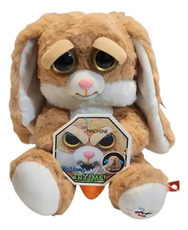
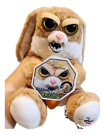

<!doctype html>
<html lang="pt-BR">
<head>
<meta charset="utf-8">
<meta name="viewport" content="width=device-width,initial-scale=1">
<title>CasaRes Play - Aluguel e Venda de Pelúcias</title>

<!-- Swiper.js -->
<link rel="stylesheet" href="https://cdn.jsdelivr.net/npm/swiper@11/swiper-bundle.min.css"/>

</head>
<body>

<header>
  <h1>CasaRes Play</h1>
  
Aluguel e venda de pelúcias — diversão garantida nas festas!

</header>

<main>

  

    🚫 <strong>AVISO IMPORTANTE:</strong> A locação de máquinas está temporariamente <strong>indisponível por tempo indeterminado</strong>. 
    Os pacotes abaixo estão apenas para visualização. 
    Mas você ainda pode comprar pelúcias conosco! 🧸
  

  <h2 class="fundo-branco">Pacotes com máquina (4 horas)</h2>
  

    

      

        

          

          

        

        

      

      

        <h3>30 pelúcias + máquina</h3>
        
R$ 1000

        

          Frete Grátis
          4 horas de uso
        

        <ul>
          <li>30 pelúcias inclusas</li>
          <li>Uso da máquina por 4 horas</li>
          <li>Frete grátis</li>
        </ul>
        <a class="cta">Indisponível no momento</a>
      

    

    

      

        

          

          

        

        

      

      

        <h3>50 pelúcias + máquina</h3>
        
R$ 1300

        

          Frete Grátis
          4 horas de uso
        

        <ul>
          <li>50 pelúcias inclusas</li>
          <li>Uso da máquina por 4 horas</li>
          <li>Frete grátis</li>
        </ul>
        <a class="cta">Indisponível no momento</a>
      

    

  

  <!-- NOVA SEÇÃO: PACOTE PERSONALIZADO -->
  <h2 class="fundo-branco" style="margin-top:40px;">Pacote Personalizado com Máquina 🧸</h2>
  

  <h2 class="fundo-branco" style="margin-top:40px;">Venda de Pelúcias 🧸</h2>
  

    

      

        

          

          

        

        

      

      

        <h3>Kit com 10 Pelúcias</h3>
        
R$ 150

        

          Entrega Fácil
          Frete Grátis
        

        <ul>
          <li>10 pelúcias sortidas</li>
          <li>Qualidade premium</li>
          <li>Envio combinado pelo WhatsApp</li>
        </ul>
        <a class="cta ativo" href="https://wa.me/5521968884003?text=Olá! Quero comprar o *Kit com 10 Pelúcias* por R$150." target="_blank">Comprar pelo WhatsApp</a>
      

    

    

      

        

          

          

        

        

      

      

        <h3>Kit com 20 Pelúcias</h3>
        
R$ 280

        

          Entrega Fácil
          Frete Grátis
        

        <ul>
          <li>20 pelúcias variadas</li>
          <li>Alta qualidade e acabamento</li>
          <li>Envio combinado pelo WhatsApp</li>
        </ul>
        <a class="cta ativo" href="https://wa.me/5521968884003?text=Olá! Quero comprar o *Kit com 20 Pelúcias* por R$280." target="_blank">Comprar pelo WhatsApp</a>
      

    

  

  

    <h3>Informações importantes</h3>
    
Tempo de locação: 4 horas. Caso precise de horário estendido ou transporte fora das regiões atendidas, entre em contato.

    <h3>Onde entregamos</h3>
    
Paracambi, Seropédica, Japeri e Conrado — frete grátis nessas localidades.

    <h3>Como comprar</h3>
    <ol>
      <li>Entre em contato por WhatsApp: <a href="https://wa.me/5521968884003" target="_blank">(21) 96888-4003</a>.</li>
      <li>Combine o kit e o endereço de entrega.</li>
      <li>Pagamento: na hora da entrega.</li>
    </ol>
  

</main>

  
  

<footer>
  © CasaRes Play — Aluguel e venda de pelúcias. 
  Contato: (21) 96888-4003 — casaresplayfesta@gmail.com
</footer>

</body>
</html>
